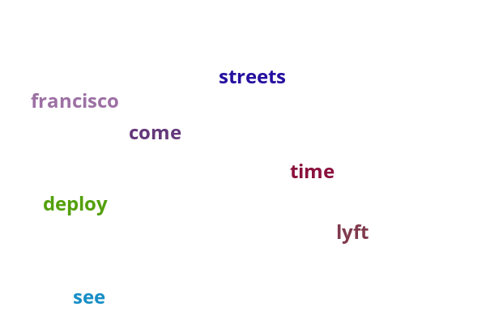

# PyWordCloudy
A happy light weight word cloud generator in Python

## Installation

Installation is simplest with pip:

    pip install pywordcloudy
    

#### Installation notes

pywordcloud depends on `nltk` and `pillow`.

pywordcloud automatically saves generated wordcloud in working directory. See [examples](#examples) below.

## Examples

Check out [A simple example](Example/main.py) for a short intro. A sample output is:

## Contributing

Feel free to submit pull requests to me.

## Authors

* **Muhammad Haseeb** - *Initial work* - [Muhammad Haseeb](https://github.com/iam-mhaseeb)

## Licensing
The pycloudy library is [MIT Licenced](LICENSE), but contains Open Sans font. Open Sans is a sans-serif typeface designed by Steve Matteson and commissioned by Google, that is apache licensed.
The font is by no means integral, and any other font can be used by placing font.ttf file in pywordcloud folder when creating a word cloud.
